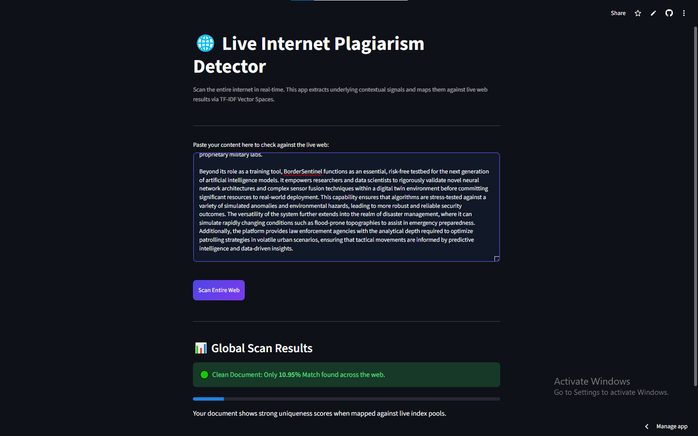

# AI-Powered Plagiarism Detector 🌐

A modern Machine Learning web application that scans text and checks for plagiarism against the live web in real time. Built entirely with Python and hosted serverless on the cloud.

## 🚀 Live Application
🔗 **[Click Here to Open Deployed App]([YOUR_STREAMLIT_APP_URL_HERE](https://ai-powered-plagiarisms-checker-etlrpwejvbcn3bqlpszpw6.streamlit.app/))**

---

## 🧠 How It Works
1. **Context Extraction:** The application processes your text input and extracts core semantic keywords.
2. **Live Web Scanning:** It queries the internet via the **Tavily Search API** to dynamically grab matching text segments from live websites.
3. **NLP Similarity Engine:** Converts raw text and scraped web content into numerical matrices using **TF-IDF Vectorization** and evaluates precise overlap using **Cosine Similarity** math.

---

## 🛠️ Tech Stack
* **Language:** Python
* **Machine Learning & NLP:** Scikit-Learn (`TfidfVectorizer`, `cosine_similarity`)
* **Web UI Framework:** Streamlit (with custom CSS styling)
* **Search Integration:** Tavily AI API

---

## 📂 Project Structure
* `app.py` - Core machine learning logic, API integration, and web dashboard layout.
* `requirements.txt` - Python package dependencies for the cloud server.
* `README.md` - Technical project documentation and guide.

## 📸 Project Screenshot
* 

## 👨‍💻 Author
Mubashshera Khan 
